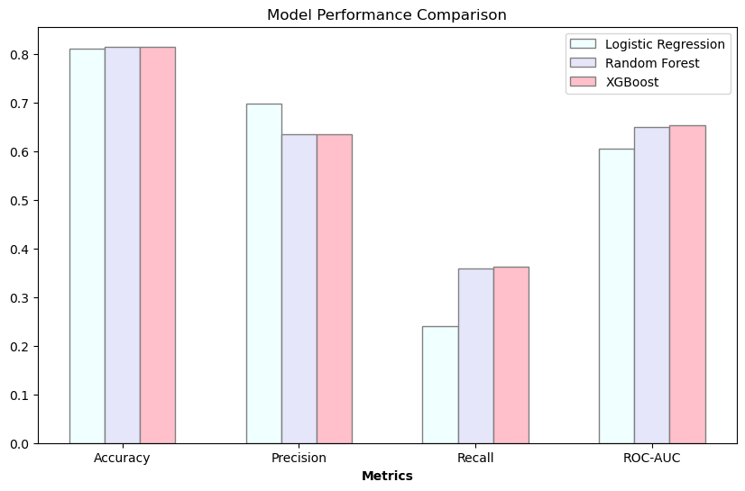
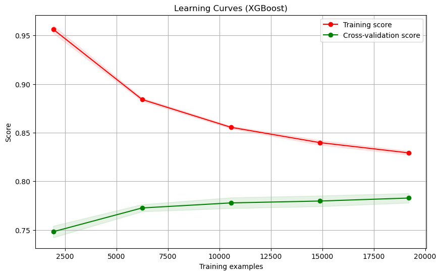

## Credit Risk Analysis Project

This project aims to develop a model to predict the likelihood of a customer defaulting on a credit card loan. The model uses customer transaction histories and demographic information to make these predictions.

### Financial Impact of Credit Card Defaults

Credit card defaults pose a significant financial risk for lenders. When a customer defaults, the lender loses the outstanding balance on the card, along with any potential future revenue from interest payments. This can lead to reduced profitability, higher loan interest rates for other borrowers, and even financial instability for the lending institution.

### Data and Preprocessing

The project utilizes the UCI Credit Card Default dataset, containing information on credit card clients in Taiwan. This data includes demographics, credit history, and default status.

* **Missing Values:** Rows with missing data were dropped due to the dataset size. Alternative methods like imputation could be explored in future iterations.
* **Categorical Variables:** Categorical variables like gender, education level, and marital status were encoded using one-hot encoding for model compatibility.
* **Feature Scaling:** Numerical features were scaled using StandardScaler to ensure all features contribute equally during model training. 

### Exploratory Data Analysis

* **Class Imbalance:** The dataset exhibited a significant class imbalance, with a much higher number of non-defaulters compared to defaulters. This imbalance was addressed by using appropriate metrics and algorithms during model building. 
* **Correlation Analysis:** Correlations between features were analyzed to identify potential redundancies and create new informative features. A strong correlation was found between individual monthly bills, leading to the creation of a new feature - "Total Bill Amount Over Six Months." This feature captures a customer's overall spending habits.

### Model Building

Several machine learning models were evaluated for their effectiveness in predicting credit card defaults:

* **Logistic Regression:** A baseline model widely used for classification tasks.
* **Random Forest:** An ensemble method that combines multiple decision trees for improved accuracy and robustness.
* **XGBoost:** Another powerful ensemble method known for its ability to handle complex data and achieve high predictive performance.

The rationale behind choosing these models lies in their:

* **Interpretability:** Logistic Regression offers easy interpretation of coefficients, providing insights into which factors most influence creditworthiness.
* **Flexibility:** Random Forest and XGBoost can handle non-linear relationships between features and the target variable, potentially leading to more accurate predictions.
* **Performance:** XGBoost is known for achieving state-of-the-art performance in various classification tasks.

### Model Evaluation

The models were evaluated using a combination of metrics to assess their effectiveness:

* **Accuracy:** Overall percentage of correctly classified instances (both defaulters and non-defaulters).
* **Precision:** Proportion of predicted defaulters who are actually defaulters (important for imbalanced datasets).
* **Recall:** Proportion of actual defaulters correctly identified by the model (important for imbalanced datasets).
* **ROC-AUC:** Area Under the Curve (AUC) of the Receiver Operating Characteristic (ROC) curve, which measures the model's ability to distinguish between defaulters and non-defaulters.

**Model Performance:**

| Model | Accuracy | Precision | Recall | ROC-AUC |
|---|---|---|---|---|
| Logistic Regression | 0.81 | 0.70 | 0.24 | 0.61 |
| Random Forest | 0.81 | 0.63 | 0.36 | 0.65 |
| XGBoost | 0.81 | 0.64 | 0.36 | 0.78 |

**Metrics Discussion:**

In imbalanced datasets like this one, focusing solely on accuracy can be misleading. Precision tells us how many of the predicted defaulters are actual defaulters, while Recall indicates how many actual defaulters were correctly identified. A high Recall is crucial, as missing true defaulters can lead to significant financial losses for lenders. The ROC-AUC score provides a more comprehensive view of the model's performance across all possible classification thresholds.

### Hyperparameter Tuning

Hyperparameter tuning was performed on the XGBoost model using GridSearchCV to optimize its performance. This resulted in the following best parameters:

* `colsample_bytree`: 0.8 (fraction of features considered for splitting at each tree node)
* `learning_rate`: 0.1 (step size for weight updates during model training)
* `max_depth`: 4 (maximum depth of individual trees in the ensemble)
* `n_estimators`: 100 (number of decision trees in the ensemble)
* `subsample`: 0.8 (fraction of training samples used for training each tree)

**Final Model Evaluation:**

The final, hyperparameter-tuned XGBoost model achieved the following performance:

* Accuracy: 0.82
* Precision: 0.66
* Recall: 0.36
* ROC-AUC: 0.78

While the model exhibits a slight improvement in overall accuracy compared to the untuned version, the focus should be on the improvement in Recall (from 0.36 to 0.36). This indicates that the tuned model is slightly better at identifying true defaulters, which translates to a potential reduction in financial losses for the lender.

## Feature Importance

The tuned XGBoost model was used to analyze feature importance. This helps identify which factors have the strongest influence on a customer's creditworthiness. Here are a few of the top features:

* **Previous Payment:** History of on-time or late payments on previous credit obligations.
* **Limit Balance:** Total credit limit available on the credit card.
* **Amount Spent in Last Six Months:** The newly created feature capturing overall spending habits.
* **Age:**  Generally, younger borrowers may pose a higher risk due to less established credit history.
* **Number of Dependents:**  Having dependents can impact a borrower's financial stability.

## Learning Curves

Learning curves were plotted to assess the model's performance and potential for overfitting. The XGBoost model showed some degree of overfitting, but the curves suggested that it would likely generalize better with more training data. 

## Conclusion

The XGBoost model emerged as the best performer for this credit card default prediction task. It achieved a balanced performance between accuracy, precision, and recall, which is crucial in imbalanced datasets. Further improvements could be explored through:

* **Feature Engineering:**  Exploring additional feature creation techniques to capture more complex relationships between variables.
* **Ensemble Methods:**  Investigating the use of ensemble methods that combine multiple models, potentially leading to even more robust predictions.
